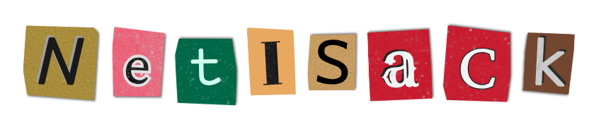

[gists](https://gist.github.com/NETiSACK) | [old github acc 1](https://github.com/fault2004) | [old github acc 2](https://github.com/landonMF4)

I'm currently developing "something" desktop/web applications based on Lua Language.

- Learning `C`, `Lua`, `Lapis`, `PostgreSQL`
- Learning Reverse Engineering on `USB Communication Protocol`
- OS Environments `Windows 10`, `Debian 12 (WSL2)`
- Editors of choice `Lite XL`, `Neovim`, `VSCode`
